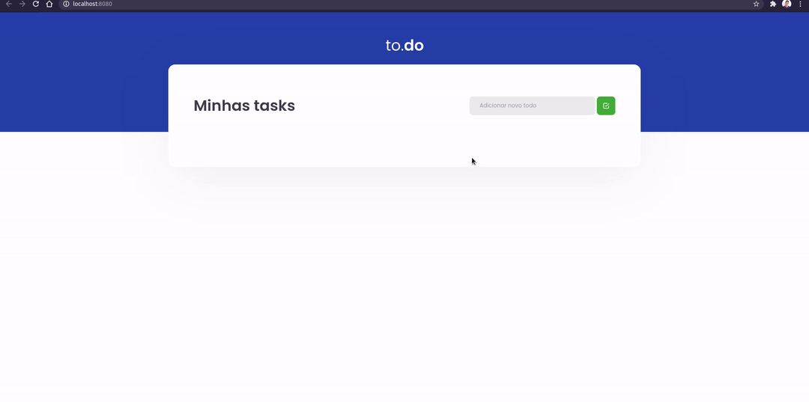

<p align="center">
   <a href="https://www.linkedin.com/in/gustavo-vieira-martins-2b1501168/">

   </a>

  <a href="https://github.com/gustavo-gvm/proffy/commits/master">
    
  </a> 
  
</p>

<p align="center">
   
</p>

> :rocket: <strong>ToDo</strong> é uma plataforma de gernciamento de atividades. Onde é possível criar atividades, remover, e marcar como feita ou a fazer.

# :pushpin: Índice

<!-- * [Site de Demostração](#eyes-site-de-demostração) -->
* [Tecnologias](#computer-tecnologias)
* [Como rodar](#construction_worker-como-rodar)
* [Encontrou um bug? Ou está faltando uma feature?](#bug-problemas)
* [Licença](#closed_book-licencia)

# :computer: Tecnologias

Esse projeto foi feito utilizando as seguintes tecnologias:

* [Typescript](https://www.typescriptlang.org/)
* [React](https://reactjs.org/)

# :construction_worker: Como rodar

###### Clone o Repositório

```bash
$ git clone https://github.com/gvieiram/ToDo.git
```

### 💻 Rode o Projeto

```bash
# Vá para a pasta web
$ cd suaPasta

# Instale as dependências
$ yarn

# Rode a aplicação
$ yarn dev
```

Acesse: <http://localhost:8080/> para ver o resultado.

# :bug: Problemas

Fique a vontade **para criar uma nova issue** com o respectivo título e descrição na página de issues do [ToDo](https://github.com/gvieiram/ToDo/issues). Se você já encontrou a solução para o problema, **Eu amaria fazer o review do seu pull request**!

# :closed_book: Licença

Lançado em 2021 :closed_book: Licença

Feito com :heart: por [Gustavo Vieira Martins](https://github.com/gvieiram).
Esse projeto esta sobre [MIT license](./LICENSE).
Dê uma ⭐️ se esse projeto te ajudou!